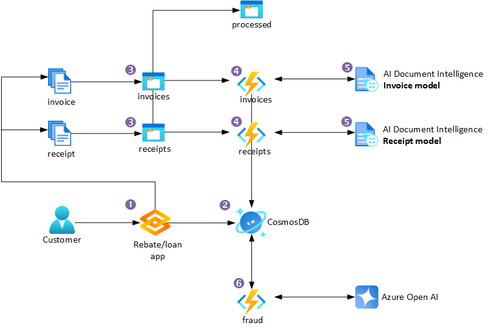

<p align="center">
  
</p>
<h1 align="center">
  Automated document processing and fraud detection with Azure
  <br>
</h1>

<h4 align="center">Let's build a sample document processing pipeline using Azure Document Intelligence and Azure Open AI to process financial documents and perform fraud detection..</h4>

<p align="center">
  <a href="#key-features">Key Features</a> •
  <a href="#diagram">Diagram</a> •
  <a href="#how-to-use">How To Use</a> •
  <a href="#license">License</a> •
  <a href="#contact">Contact</a>
</p>

## Key Features

* Multiple documents types can be processed
  * This sample can is setup to prcoess invoices and recipts using the prebuilt Azure Azure Document Intelligence models.
* Fraud summary Generated by Azure Open AI
  * Each application is summarised by Azure Open AI to dected potential fraud.
* Information stored in Cosmos DB
  * All information is stored in Cosmos DB for later retrieval.
* Includes two prebuilt frontends
  * Gradio has been used to create two front ends to interact with the process. One to submit the application and one to view the results.
* Azure Functions
  * The process is run as an Azure Functions (Platform as a Service) so there is no admin overhead.

## Diagram



## Pre-req Azure components

This repo has the code for all three functions used in this process, but there are some pre-req components that need to be created in Azure before you can deploy the code.

* Cosmos DB
  * Create a Cosmos DB account with a SQL API
  * Create a database called "ToDoList"
  * Create a container called "docs"
  * Create a container called "leases"
* Azure Blob Storage
  * Create a Blob Storage account
  * Create a container called "invoice"
  * Create a container called "receipt"
  * Create a container called "processed"
* Azure AI Document Intelligence
  * Create a Document Intelligence resource
* Azure Open AI
  * Create an Open AI resource
  * Create a deployment that uses GPT-4 called "gpt-4"
* Azure Functions
  * Create an Azure Functions app
  * Deploy the python function code to the Azure Functions app
  * this should create 3 functions; invoice, receipt and fraud

## How To Use

To clone and run this application, you'll need [Git](https://git-scm.com) installed on your computer.

```bash
# 1. Clone this repository
$ git clone https://github.com/fredderf204/doc-intel-fraud

# 2. Go into the repository
$ cd doc-intel-fraud

# If you would like to test the functions locally first, deploy all of the pre-req Azure Components, except for the three Azure Functions. Then skip to number 4.
# 3. Deploy the pre-req Azure Components (More Options coming shortly) 

# If you would like to test the functions locally first, you can run the following commands to install the dependencies and run the functions locally with either option 4a or 4b.
# 4a. Run the Function code locally, using Azure Functions Core Tools (More Options coming shortly)
$ cd functions
$ python3 -m venv .venv
$ pip install -r requirements.txt
$ func start

# 4b. Run the Function code locally, using VS Code (More Options coming shortly)
$ cd functions
$ python3 -m venv .venv
$ pip install -r requirements.txt
click on function_app.py
click on the debug icon.

# 4c. Deploy the Function code to Azure, using Azure Functions Core Tools (More Options coming shortly) 
$ func azure functionapp publish <functionappname>

# 5. Run the Gradio application front end
$ cd gradio
$ python3 -m venv .venv
$ pip install -r requirements.txt
click on client-demo-multi.py
click on the debug icon

# 6. Run the Gradio application processor front end
click on processor-demo.py
click on the debug icon
```

## License

MIT License

Copyright (c) [2023] [Michael Friedrich]

Permission is hereby granted, free of charge, to any person obtaining a copy
of this software and associated documentation files (the "Software"), to deal
in the Software without restriction, including without limitation the rights
to use, copy, modify, merge, publish, distribute, sublicense, and/or sell
copies of the Software, and to permit persons to whom the Software is
furnished to do so, subject to the following conditions:

The above copyright notice and this permission notice shall be included in all
copies or substantial portions of the Software.

THE SOFTWARE IS PROVIDED "AS IS", WITHOUT WARRANTY OF ANY KIND, EXPRESS OR
IMPLIED, INCLUDING BUT NOT LIMITED TO THE WARRANTIES OF MERCHANTABILITY,
FITNESS FOR A PARTICULAR PURPOSE AND NONINFRINGEMENT. IN NO EVENT SHALL THE
AUTHORS OR COPYRIGHT HOLDERS BE LIABLE FOR ANY CLAIM, DAMAGES OR OTHER
LIABILITY, WHETHER IN AN ACTION OF CONTRACT, TORT OR OTHERWISE, ARISING FROM,
OUT OF OR IN CONNECTION WITH THE SOFTWARE OR THE USE OR OTHER DEALINGS IN THE
SOFTWARE.

---

## Contact

> LinkedIn [Michael Friedrich](https://www.linkedin.com/in/1michaelfriedrich/) &nbsp;&middot;&nbsp;
> GitHub [fredderf204](https://github.com/fredderf204) &nbsp;&middot;&nbsp;
> Twitter [@fredderf204](https://twitter.com/fredderf204)